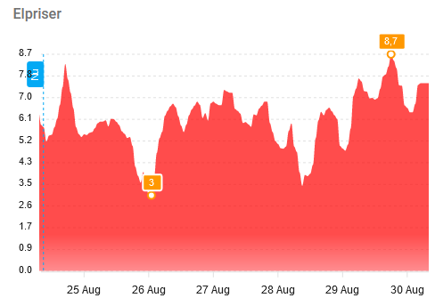
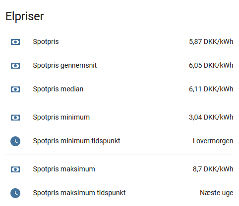

# Energy Assistant (for carnot.dk)

**NB! This add-on is only useful when connected to the Danish electricity grid!**

This add-on makes it easy to create automations in Home Assistant using the grid spot price data and predictions from [CARNOT](https://www.carnot.dk).

This add-on has been written in F# as a hobby project for fun and use - but could easily be created in a similar fashion as a Home Assistant integration.  However, that's beyond my current scope.

It runs in F# and integrates with Home Assistant throgh MQTT (including discovery).

## Installing

1. Go to Settings -> Add-ons -> Store for Add-ons
2. Click the `...` button in the top
3. 

## Getting the API key

1. Visit [carnot.dk](https://www.carnot.dk/profile/create) to create a profile.
1. Open your profile and generate an API key

## Configuration

The add-on requires som configuration.

### MQTT

The following defaults are provided.  If you are running the Mosquitto add-on, you will need to add a user for Energy Assistant in the module's configuration, which can then be used here.

```yaml
server: "core-mosquitto"
port: 1883
user: ""
pwd: ""
client_id: "Energy Assistant"
use_tls: false
```

### Carnot

The following defaults are provided.

You can use region `dk1` (West Denamrk) or `dk2` (East Denmark).  `user` is the email address you used to create your carnot.dk account and `api_key` is the key you generated above.

```yaml
region: "dk2"
user: ""
api_key: ""
```

### Additional costs

Additional costs can be added to the raw price.

- Fixed cost is added per kWh
- Peak tariff is added Nov-Mar from 17-20
- Regular tariff is added when not peak
- Fee is added per kWh
- VAT is is tax percentage to add on top at the end

```yaml
fixed_cost: 0.0
peak_tariff: 0.0
regular_tariff: 0.0
fee: 0.0
vat: 0.0
```

### Spans (Coming soon)

The following example will provide start times for:

1. The best time to do the laundry in the next 48 hours, based on a load taking 2 hours and that it can be run any time of day.
1. The best time to charge the EV after work in the next 18 hours, based on a charge taking 3 hours in the span of 17:00 to 06:00.

Examples of how these can be used in Home Assistant to trigger automations will be shown below.

```yaml
- title: Next laundry
  hours: 2
  max_hours_future: 48
- title: Next EV charge
  hours: 3
  max_hours_future: 18
  hours_of_day: "0|1|2|3|4|5|17|18|19|20|21|22|23"
```

## Home Assistant

When configured correctly the entities will appear automatically in HA.

### Entities

#### Basic

The following entities are always there:

| Entity | Description |
|--------|-------------|
| sensor.spotprice | The current spot price |
| sensor.spotprice_minimum | The lowest spot price in the period |
| sensor.spotprice_minimum_time | The timestamp when the lowest spot price occurs |
| sensor.spotprice_maximum | The highest spot price in the period |
| sensor.spotprice_maximum_time | The timestamp when the highest spot price occurs |
| sensor.spotprice_average | The average spot price |
| sensor.spotprice_median | The median spot price |

#### Spans (Coming sooon)

The following is an example of the entity created for a span:

### Graph

To display a graph like this in Home Assistant:



You can install ApexChart using HACS and add the following to Lovelace:

```yaml
type: custom:apexcharts-card
experimental:
  color_threshold: true
header:
  show: true
  title: Elpriser
now:
  show: true
  label: Nu
span:
  start: hour
graph_span: 144h
yaxis:
  - min: 0
    max: ~4
series:
  - entity: sensor.spotprice
    type: area
    show:
      extremas: true
    stroke_width: 0
    data_generator: |
      return entity.attributes.prices.map((start, index) => {
        return [new Date(start["hour"]).getTime(), entity.attributes.prices[index]["price"]];
      });
    color_threshold:
      - value: 0
        color: green
        opacity: 1
      - value: 1.5
        color: yellow
      - value: 2
        color: pink
      - value: 4
        color: red
```

### Entities

You can also show the basic entities like this:



Using the following:

```yaml
type: entities
entities:
  - entity: sensor.spotprice
  - entity: sensor.spotprice_average
  - entity: sensor.spotprice_median
  - type: divider
  - entity: sensor.spotprice_minimum
  - entity: sensor.spotprice_minimum_time
  - type: divider
  - entity: sensor.spotprice_maximum
  - entity: sensor.spotprice_maximum_time
title: Elpriser
show_header_toggle: false
```

**Note: The entity names can be changed by clicking the entities, like in the above where the names have been translated.**

### Automation examples (Coming soon)

